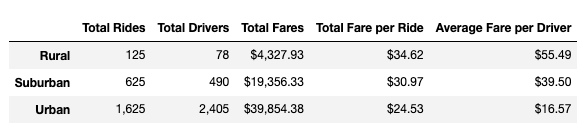
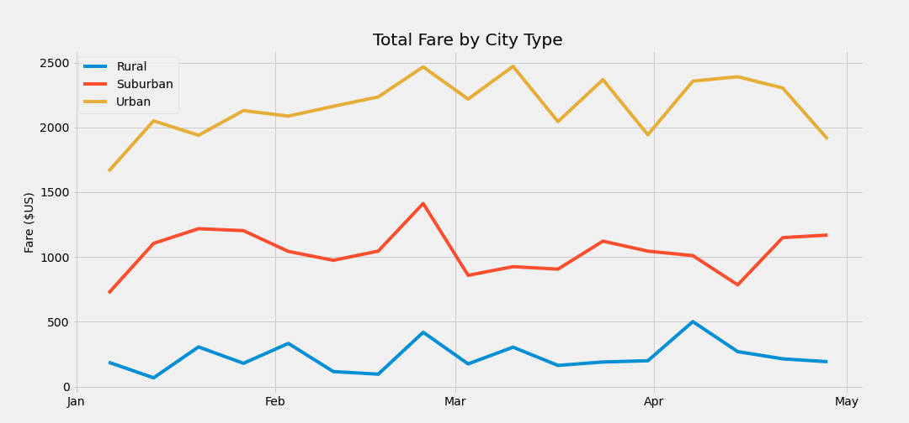

# PyBer_Analysis

## 1. Overview of Election Audit

### 1.1. Purpose
The purpuse of this project is analize all the rideshare data from January to early May of 2019 by city type, organizing all the information trough tables and graphics to allow the CEO visualize the results in order to make future decisions.

## 2. Results
According the table information we can observe that in the Urban City Type there is the largest number of drivers: 2405 but the least number of rides: 1625 compared to the number of drivers, which means that there were 780 drivers who did not have rides, we can also see that in this area the total fare per ride: $ 24.53 is the lowest of all.

In the Suburban city type it is observed that the number of rides: 625 was greater than the number of drivers: 490 and fare per ride: $30.97, is greater than the Urban area.

In the same way that the Suburban area in the Rural City Type area had more rides: 125 and fewer drivers:78 , also we can see that this area is the one with the highest fare per ride: $34.62.

In summary, in the Suburban and Rural areas, there was a lack of drivers comparing with the number of rides.

  

  

## 4. Summary

We recommend the CEO to relocate at least 135 drivers from the Urban to the Suburban city type, and 77 drivers to the Rural city in order to cover the total number of rides of both city types. 

